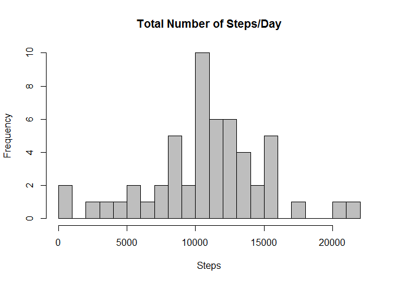
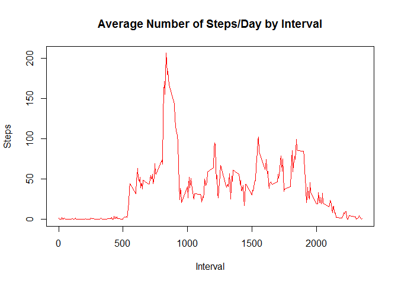
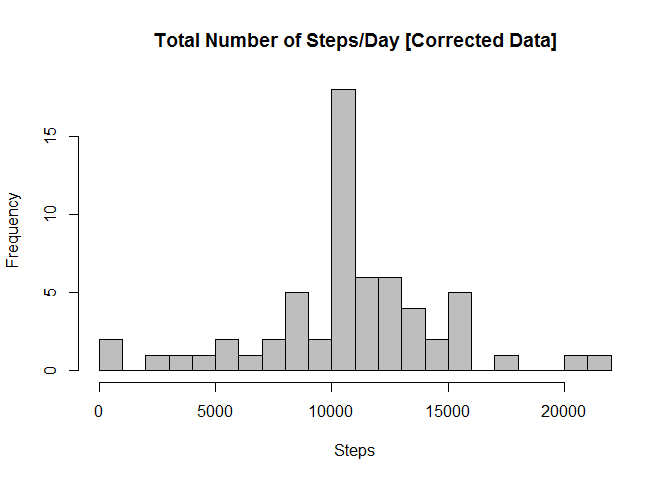
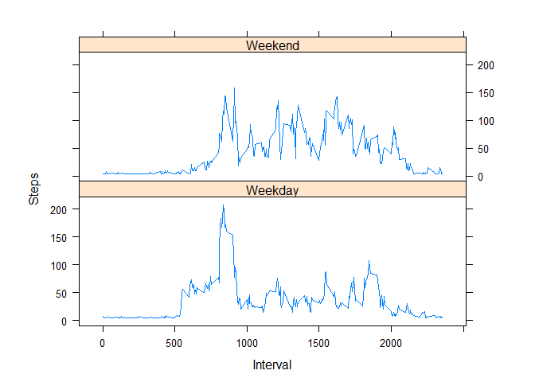

# Reproducible Research: Peer Assessment 1


## Introduction
This document is result of the Peer Assesment 1 project work for John Hopkins University Reproduciple Research course. Data used in this document contains  the number of steps taken by one anonymous individual and recorded using an activity device. 

## Loading and preprocessing the data
Data is located in course web site and it has to be retrieved and unzipped. Actual data file is called *activity.csv*

The variables included in this dataset are:

- **steps:** Number of steps taking in a 5-minute interval (missing values are coded as NA)
- **date:** The date on which the measurement was taken in YYYY-MM-DD format
- **interval:** Identifier for the 5-minute interval in which measurement was taken


```r
# create variables for file handling
url <- "https://d396qusza40orc.cloudfront.net/repdata%2Fdata%2Factivity.zip"
file <- "./activity.csv"
destination <- "activitydata.zip"

# load and unzip activity.csv if not found
if (!file.exists(file)) {
    download.file(url, destfile = destination)
    unzip(destination)
    file.remove(destination)
}

#read activity.csv
activitydata <- read.csv(file)
```

## What is mean total number of steps taken per day?
Data is agregated by date and histogram is produced to represent the total number of steps taken each day. Breaks is set to 30 for better resolution.


```r
# create histogram
dailysteps <- aggregate(steps ~ date, activitydata, sum)
hist(dailysteps$steps, breaks = 30, main = "Total Number of Steps/Day", xlab = "Steps", col = "grey")
```

<!-- -->

```r
# calculate mean and median
dailysteps_mean <- mean(dailysteps$steps)
dailysteps_median <- median(dailysteps$steps)
```

**Mean** is **10766.19** and **median** is **10765.00**.


## What is the average daily activity pattern?
Produce Time series plot of the average number of steps taken. 

```r
stepsinterval <- aggregate(steps ~ interval, activitydata, mean)
plot(stepsinterval$interval, stepsinterval$steps, type = "l", xlab = "Interval", ylab = "Steps", col = "red" , main = "Average Number of Steps/Day by Interval")
```

<!-- -->

```r
max <- stepsinterval[which.max(stepsinterval$steps), 1]
```

The 5-minute interval that, on average, contains the maximum number of steps is **835**.

## Imputing missing values
There is missing data in source file (**NA**) that needs to be imputed. 


```r
# calculate total number of missing values
missing <- sum(is.na(activitydata$steps))
```

In total there is **2304** missing values.

In this case missing values are filled with the mean value of the dataset since only simple imputing strategy was required.


```r
# create corrected data set
correcteddata <- activitydata
correcteddata$steps[is.na(correcteddata$steps)] <- mean(activitydata$steps, na.rm = TRUE)

#draw histogram
dailysteps_corrected <- aggregate(steps ~ date, data = correcteddata, sum)
hist(dailysteps_corrected$steps, breaks=30, main = "Total Number of Steps/Day [Corrected Data]", xlab = "Steps", col = "grey")
```

<!-- -->

```r
# calculate mean and median for corrected data
dailysteps_mean_corrected <- mean(dailysteps_corrected$steps, na.rm=TRUE)
dailysteps_median_corrected <- median(dailysteps_corrected$steps, na.rm=TRUE)
```

**Mean** for corrected data is **10766.19** and **median** is **10766.19**.

Mean for corrected data set are exactly the same than mean for original data. Median has changed slightly since we added values to dataset.

## Are there differences in activity patterns between weekdays and weekends?

Panel plot is used to visualize the patterns for weekdays and weekend.Factor variable is used to separate data for weekdays and weekends.


```r
# modify timestamp to correct format
correcteddata$date <- as.Date(correcteddata$date)

# create vector for weekend days
weekend <- c("Saturday", "Sunday")

# generate day names to dataset
correcteddata$day <- weekdays(correcteddata$date)
correcteddata$weekend <- as.factor(ifelse(correcteddata$day %in% weekend, "Weekend", "Weekday"))

# draw histograms
library(lattice)
patterndata <- aggregate(steps ~ interval + weekend, correcteddata, mean)
xyplot(steps ~ interval | factor(weekend), data = patterndata, type = "l", aspect = 1/3, xlab = "Interval", ylab = "Steps" )
```

<!-- -->

